# Optimization and Machine Learning Prediction of Tensile and Compressive Strengths for Additively Manufactured ABS Automotive Components

**Course:** Introduction to Digital Manufacturing
**Team:** 016 – Gedela Kiran Kumar; 021 – Kapuluru Chenchu Sai Sashank; 028 – Sai Mani; 035 – Perumalla Krishna Murthy
**Institution:** Department of Computer Science and Engineering, Amrita Vishwa Vidyapeetham, Amaravati Campus
**Base paper:** G.A. Munshi, V.M. Kulkarni, S. Yargatti, "Computation of tensile and compressive strengths of additively manufactured ABS material for automotive applications using ANN algorithms", *Next Materials* 10 (2026) 101420. https://doi.org/10.1016/j.nxmate.2025.101420
**Dataset source:** https://doi.org/10.5281/zenodo.15449938 (Zenodo record 15449938, version 4, CC-BY 4.0)

---

## Abstract
Material extrusion, also called fused deposition modelling (FDM), is increasingly used to make functional automotive parts from acrylonitrile butadiene styrene (ABS), but the strength of a printed part depends strongly on the process parameters. This work builds on the study of Munshi et al., which predicted the tensile and compressive strength of FDM-printed ABS with artificial neural networks (ANNs), and uses the same openly published 383-record dataset with five process parameters: nozzle temperature, bed temperature, print speed, layer height and infill density. Nine regression models were trained and compared: replications of the paper's Adam-optimised and Bayesian-regularised ANNs, three classical regressors and four tree ensembles. Every model was evaluated with nine metrics (MSE, RMSE, MAE, MAPE, R², adjusted R², explained variance, maximum error and median absolute error) under an 80/20 hold-out split and 5-fold cross-validation. Histogram-based gradient boosting performed best on almost every metric, with a cross-validated R² of 0.9995 for both strengths, RMSEs of 0.25 MPa (tensile) and 0.31 MPa (compressive) and a mean absolute percentage error of about 0.65 %. SHAP analysis, expressed in MPa, explains every individual prediction: infill density contributes about 62 % of the explained variation, layer height about 23 % and print speed about 11 %, while bed temperature has no measurable effect. A robust differential-evolution optimiser, verified against an exhaustive search of all 960 tested parameter combinations, identifies the maximum-strength recipe: 0.2 mm layers, at least 95 % infill and at most 35 mm/s. This recipe gives about 50.4 MPa tensile and 63.0 MPa compressive strength. Constrained optimisation gives the fastest recipes that meet the requirements of the paper's two automotive case studies: a brake pedal (compressive strength ≥ 45 MPa, 75 % shorter print time than the maximum-strength recipe) and a door handle (tensile strength ≥ 30 MPa, 87.5 % shorter print time).

**Keywords:** Digital manufacturing; Fused deposition modelling; ABS; Machine learning; Gradient boosting; Regression metrics; SHAP explainability; Differential evolution; Process optimisation; Automotive components

---

## 1. Introduction
Additive manufacturing (AM) lets automotive manufacturers produce brackets, ducts, interior trim and functional prototypes without tooling. Material extrusion, commonly called fused deposition modelling (FDM), is the most widely used polymer AM process. ABS is one of its most common materials because of its toughness, impact resistance and a heat-deflection temperature of about 80 °C [1]. An FDM part, however, is built bead by bead and layer by layer. Its strength therefore depends on how well neighbouring beads fuse and on how much solid material fills the part, and both are governed by the process parameters [2, 3, 4]:

1. **Nozzle temperature** controls melt viscosity and the diffusion of polymer chains across bead interfaces.
2. **Bed temperature** limits warping and residual stresses near the build plate.
3. **Print speed** sets the time available for bonding before the bead cools.
4. **Layer height** sets the bead cross-section and the size of the voids between beads.
5. **Infill density** sets the fraction of the part's interior that carries load.

**Existing work.** Sood et al. [2] related layer thickness, orientation, raster angle, raster width and air gap to the strength of FDM ABS parts with response-surface methodology. Rayegani and Onwubolu [5] predicted FDM tensile strength with group-method-of-data-handling networks and optimised it with differential evolution. Alafaghani et al. [3] studied infill, layer height and extrusion temperature with Taguchi experiments, and Mohamed et al. [4] reviewed the optimisation of FDM parameters. These design-of-experiments and response-surface models capture only low-order effects of the parameters. The reviews of Meng et al. [6] and Goh et al. [7] identify machine learning (ML), which learns the full non-linear relationship from data, as the key tool for process–property modelling in AM. Most recently, Munshi et al. [1] compiled 383 tensile and compressive strength records of FDM-printed ABS and published them openly [8]. They trained Adam-optimised and Bayesian-regularised ANNs, reported R² = 0.93/0.98 (Adam) and 0.90/0.95 (Bayesian) for tensile/compressive strength on a Taguchi L15 validation set, and discussed a brake pedal and a door handle as automotive applications.

**Techniques used in this work.** Tree ensembles are among the most accurate ML models for small tabular datasets. A random forest [9] averages many decorrelated decision trees, which reduces variance. Gradient boosting adds trees one after another, each correcting the errors of the previous ones; histogram-based gradient boosting [10] and XGBoost [11] are fast, regularised implementations of this idea. SHAP (SHapley Additive exPlanations) [12] uses cooperative game theory to split each individual prediction exactly into the contributions of the input parameters. Differential evolution [13] is a population-based global optimiser that needs no gradients, which suits tree models whose predictions change in steps. All methods were implemented in Python with scikit-learn [14] and SciPy [15].

**Literature gap.** The study of [1] leaves three questions open. First, it does not evaluate modern tree ensembles on its own data: the comparison models in its tables come from other studies on other datasets. Second, it does not explain *why* a model predicts a given strength for a given recipe. Third, it does not search for the optimal printing parameters, which it lists as future work.

**This work.** The objectives of this project were therefore to:

1. replicate the paper's models on the same dataset and compare the results directly with its published tables;
2. evaluate nine models with nine regression metrics under hold-out and 5-fold cross-validation, and explain what the metrics show;
3. explain individual predictions in physical units (MPa) with SHAP;
4. formally optimise the process parameters, analyse their sensitivity and derive recipes for the two automotive case studies;
5. make the trained model available as an interactive simulator.

Section 2 describes the dataset and methodology, Section 3 presents and discusses the results, and Section 4 concludes the report.

---

## 2. Methodology

Figure 1 summarises the workflow. The dataset is pre-processed, nine models are trained and evaluated, the best model is refitted on all data, and that model is then used for the explanations, the optimisation, the case studies and the simulator.

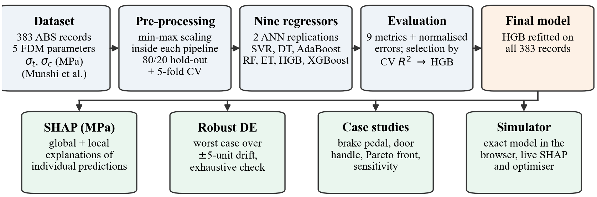
*Figure 1. Overview of the workflow, from the dataset to explanations, robust optimisation and the interactive simulator.*

### 2.1 Dataset
The dataset is the one released with the base paper on Zenodo [8] (file `Experimental Dataset.xlsx`, record 15449938, version 4). According to Section 2.5 of [1], it contains 383 tensile and compressive strength values of virgin, commercial-grade ABS. The values were compiled from peer-reviewed studies and test reports on ASTM D638 (tensile) and ASTM D695 (compressive) standard specimens [16, 17], and outliers beyond 3σ were removed. There are no missing values and no duplicate rows. Table 1 summarises the data.

**Table 1. Descriptive statistics of the dataset (n = 383).**

| Variable | Min | Max | Mean | Std. dev. | Skewness | Tested levels |
|:--|--:|--:|--:|--:|--:|:--|
| Nozzle temperature (°C) | 200 | 250 | 223.97 | 17.44 | 0.06 | 200, 210, 220, 230, 240, 250 |
| Bed temperature (°C) | 50 | 110 | 79.19 | 22.49 | 0.05 | 50, 70, 90, 110 |
| Print speed (mm/s) | 10 | 70 | 40.23 | 22.37 | −0.05 | 10, 30, 50, 70 |
| Layer height (mm) | 0.2 | 0.8 | 0.51 | 0.30 | −0.07 | 0.2, 0.8 |
| Infill density (%) | 20 | 100 | 58.12 | 27.85 | 0.06 | 20, 40, 60, 80, 100 |
| Tensile strength (MPa) | 5.8 | 50.6 | 23.11 | 11.99 | 0.34 | 57 distinct values |
| Compressive strength (MPa) | 7.3 | 63.3 | 28.91 | 14.98 | 0.34 | 57 distinct values |

Every parameter takes only a few discrete levels, and layer height in particular has just two (0.2 and 0.8 mm). The optimiser therefore searches only inside this window and treats layer height as a two-level factor (Section 2.6). All skewness values are small (|skew| < 0.5), so no transformation of the variables was needed.

### 2.2 Pre-processing and validation
Inputs and targets were min-max scaled to [0, 1], as in Section 2.5.2 of [1]. The scalers are part of each model pipeline, so they are fitted on the training portion of every split only and no information leaks from the test data. All results are reported in MPa after inverse scaling. Two validation schemes were used:

* **Hold-out:** 80 % training (306 records) and 20 % testing (77 records), random seed 42.
* **5-fold cross-validation (CV):** shuffled K-fold (seed 42) on all 383 records. A fresh, independently trained model is used in every fold, and the mean ± standard deviation of every metric is reported.

The best model is chosen by its mean cross-validated R² over both strengths. For the explanations and the optimisation, it is then refitted on all 383 records.

### 2.3 Models
*Replications of the base paper (Section 2.6 of [1]):*
1. **Adam-optimised ANN:** two hidden layers of 20 tanh neurons, Adam optimiser, learning rate 10⁻³, batch size 32, 1000 epochs, mean-squared-error loss. The paper does not state the layer width, so 20 neurons was assumed.
2. **Bayesian-regularised ANN:** two hidden layers of 20 tanh neurons and a linear output. MATLAB's Bayesian-regularisation training is not available in scikit-learn, so it was approximated with a quasi-Newton optimiser (L-BFGS) and an L2 weight penalty (α = 0.01).
3. **Classical models** from the paper's comparison tables: support vector regression (SVR, RBF kernel, C = 20, ε = 0.05), a decision tree (maximum depth 7) and AdaBoost (100 estimators).

*Proposed ensembles:*

4. **Tuned random forest** (300 trees, maximum depth 12) [9].
5. **Extra trees** (300 trees, maximum depth 14).
6. **Histogram-based gradient boosting (HGB):** 300 iterations, learning rate 0.05, maximum depth 6, L2 regularisation 0.1; one model per strength [10].
7. **XGBoost:** 350 trees, learning rate 0.04, maximum depth 5, subsample 0.85; one model per strength [11].

### 2.4 Evaluation metrics
Each strength is evaluated separately with nine metrics. In the formulas, yᵢ is the measured value, ŷᵢ the prediction, ȳ the mean, n the number of samples and p = 5 the number of parameters. The first five metrics are those of the base paper (Eqs. 1–5 of [1]); the last four were added to give a complete picture.

| Metric | Formula | What it shows |
|:--|:--|:--|
| MSE (MPa²) | (1/n) Σ (yᵢ − ŷᵢ)² | Average squared error; penalises large errors strongly |
| RMSE (MPa) | √MSE | Typical error size in the units of strength |
| MAE (MPa) | (1/n) Σ \|yᵢ − ŷᵢ\| | Average error size; less sensitive to single large errors |
| MAPE (%) | (100/n) Σ \|(yᵢ − ŷᵢ)/yᵢ\| | Relative error; weights errors on weak specimens more |
| R² | 1 − Σ(yᵢ − ŷᵢ)² / Σ(yᵢ − ȳ)² | Fraction of the variation in strength that the model explains |
| Adjusted R² | 1 − (1 − R²)(n − 1)/(n − p − 1) | R² corrected for the number of input parameters |
| Explained variance | 1 − Var(y − ŷ)/Var(y) | Like R², but ignores a constant offset; if it equals R², the model is unbiased |
| Max error (MPa) | max \|yᵢ − ŷᵢ\| | Worst single prediction; important for safety-critical parts |
| Median AE (MPa) | median \|yᵢ − ŷᵢ\| | Error of a typical prediction; robust to outliers |

The base paper's published error values appear to be computed on normalised targets, since an MSE of 0.05 is impossible in MPa² for strengths of 6–63 MPa. We therefore also report MSE, RMSE and MAE after min-max scaling of the strengths, for a comparison on the same scale.

### 2.5 Explainability
Two explanation methods were used:
* **Permutation importance:** the drop in hold-out R² when one parameter is randomly shuffled (15 repeats).
* **SHAP** [12], computed with the exact TreeExplainer for the best model. Each prediction is split into a base value (the average prediction) plus one contribution per parameter. Because the target scaling is linear, the contributions were converted to MPa. The identity *base value + Σ contributions = prediction* was verified numerically for every record (maximum error < 10⁻¹² MPa).

### 2.6 Optimisation
**Design space.** Nozzle temperature (200–250 °C), bed temperature (50–110 °C), print speed (10–70 mm/s) and infill density (20–100 %) are continuous variables. Layer height is enumerated over {0.2, 0.8} mm.

**Robust objective.** Tree ensembles predict in steps, and the steps fall half-way between the tested levels, where no data exist. A naive optimiser therefore tends to place a recipe exactly on a step edge, where a small machine deviation causes a large loss of strength. Each recipe is therefore scored by its **worst-case predicted strength** over a process tolerance band of ±5 °C (nozzle and bed), ±5 mm/s (speed) and ±5 % (infill), evaluated on a 3⁴ = 81-point grid.

**Algorithm.** SciPy's differential evolution [13, 15] is run separately for each layer height: population 25 × 4, Sobol initialisation, mutation 0.5–1.0, recombination 0.7, up to 150 generations. Gradient polishing is disabled because the model has no useful gradient. Remaining ties on flat regions are broken in favour of the shortest print time. The recommended recipe is rounded to machine resolution (1 °C, 1 mm/s, 1 %) and checked against an **exhaustive search over all 960 tested level combinations** (6 × 4 × 4 × 2 × 5).

**Objectives.**
1. Maximise tensile, compressive and composite strength S = 0.5·σt + 0.5·σc.
2. Case studies: minimise print time subject to worst-case strength ≥ requirement + safety margin. The safety margin is 2 × the model's cross-validated RMSE (0.50 MPa tensile, 0.62 MPa compressive).
3. Pareto front of worst-case composite strength against print time, computed on a dense grid of 34,034 recipes.

**Print-time index.** Print time is proportional to the deposited volume divided by the volumetric flow rate, which is proportional to speed × layer height. With an assumed shell (perimeter, top and bottom) volume fraction φs = 0.30, the relative index is τ = 1000·(φs + (1 − φs)·ρ/100)/(v·h). A lower τ means faster production.

**Sensitivity analysis.** A one-at-a-time analysis around the optimum covers (a) local ±10 % changes of each parameter (for layer height, a switch to the other level), (b) full-range sweeps, and (c) the "near-optimal window": the range of each parameter that keeps at least 99 % of the optimal strength.

### 2.7 Implementation and interactive simulator
The complete pipeline is a Python program (`run_project.py` with the modules in `src/`). It trains and evaluates all models, writes every table and figure in this report, and runs 42 self-checks before finishing (for example: optimum within the tested window, optimum at least as good as the exhaustive search, SHAP additivity). The trained model was also exported into a self-contained web page (Section 3.8). The page reproduces the model's predictions exactly, recomputes Shapley values live for the current recipe, runs virtual load tests of the two case-study parts, and animates the optimiser.

---

## 3. Results and Discussion

### 3.1 Correlation analysis
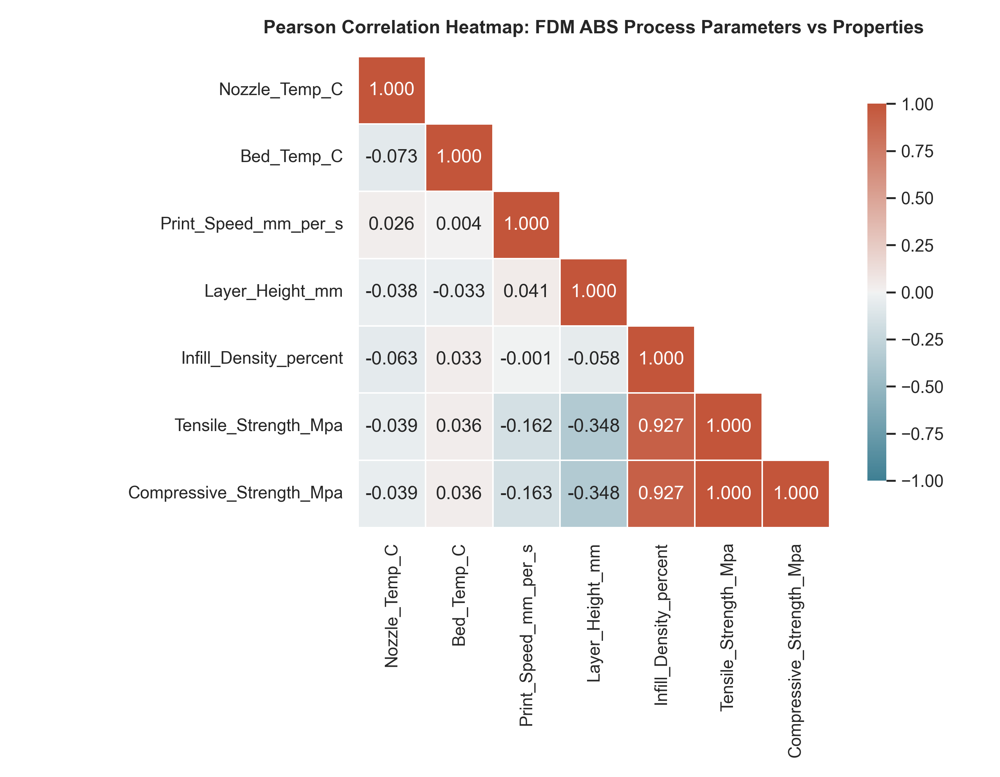
*Figure 2. Pearson correlation matrix of the five process parameters and the two strengths.*

Figure 2 shows that the five process parameters are practically uncorrelated with each other (|r| ≤ 0.07), which is what a designed factor space should look like. Infill density is by far the strongest driver of both strengths (r = +0.927), followed by layer height (r = −0.348) and print speed (r = −0.162). Nozzle temperature (r = −0.039) and bed temperature (r = +0.036) show no linear effect. The paper reports the same ranking in its correlation analysis [1]. Tensile and compressive strength are perfectly correlated in this dataset (r = 1.000): compressive strength is 1.251 ± 0.003 times the tensile strength in every record. The two targets therefore carry the same information, which explains why every model performs almost identically on both of them in the following sections.

### 3.2 Overall model performance

**Table 2. Hold-out (n = 77) and 5-fold CV (n = 383) performance. R² and RMSE are shown as tensile / compressive. Models are ranked by mean CV R².**

| Model | Hold-out R² | Hold-out RMSE (MPa) | 5-fold CV R² | 5-fold CV RMSE (MPa) | CV rank |
|:--|:--:|:--:|:--:|:--:|:--:|
| **Hist. Gradient Boosting (proposed)** | **0.9996 / 0.9996** | **0.256 / 0.323** | **0.9995 / 0.9995** | **0.249 / 0.312** | **1** |
| Extra Trees (proposed) | 0.9991 / 0.9991 | 0.381 / 0.481 | 0.9985 / 0.9985 | 0.454 / 0.574 | 2 |
| Decision Tree | 0.9993 / 0.9993 | 0.345 / 0.430 | 0.9984 / 0.9983 | 0.454 / 0.574 | 3 |
| Random Forest (proposed) | 0.9993 / 0.9993 | 0.327 / 0.409 | 0.9983 / 0.9982 | 0.482 / 0.607 | 4 |
| XGBoost (proposed) | 0.9986 / 0.9987 | 0.467 / 0.579 | 0.9982 / 0.9982 | 0.489 / 0.613 | 5 |
| Bayesian-regularised ANN (replication) | 0.9975 / 0.9973 | 0.631 / 0.827 | 0.9979 / 0.9979 | 0.538 / 0.668 | 6 |
| SVR | 0.9874 / 0.9874 | 1.425 / 1.784 | 0.9805 / 0.9803 | 1.642 / 2.058 | 7 |
| Adam-optimised ANN (replication) | 0.9845 / 0.9744 | 1.582 / 2.539 | 0.9818 / 0.9772 | 1.582 / 2.246 | 8 |
| AdaBoost | 0.9634 / 0.9638 | 2.431 / 3.019 | 0.9561 / 0.9554 | 2.478 / 3.120 | 9 |

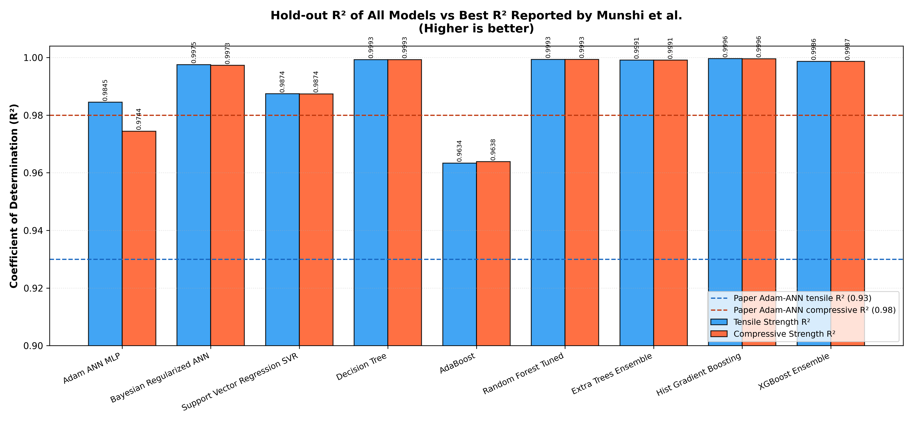
*Figure 3. Hold-out R² of all models. The dashed lines mark the best R² reported in the base paper (Adam-ANN: 0.93 tensile, 0.98 compressive).*

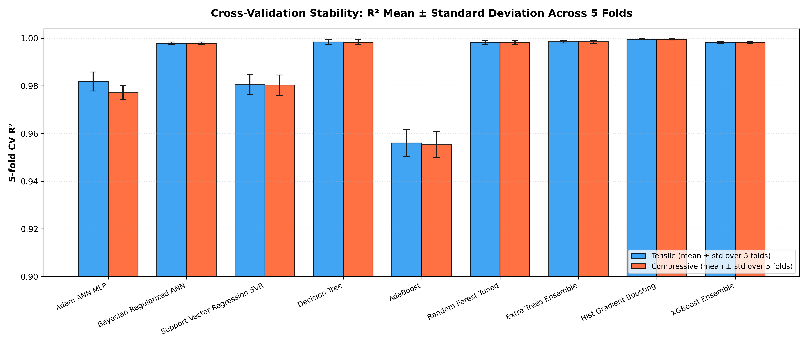
*Figure 4. 5-fold cross-validated R² of all models (mean ± standard deviation over the five folds).*

Table 2 and Figure 3 give the overall picture. Every model reaches R² > 0.95, and all tree-based models and the Bayesian ANN reach R² > 0.997. The models fall into three groups:

* **Tree ensembles and the decision tree (R² ≈ 0.998–0.9996, RMSE 0.25–0.61 MPa).** The strength in this dataset changes in steps between a few tested levels, which tree models represent naturally. HGB is the best of the group because boosting corrects the remaining errors step by step while its L2 regularisation and shallow trees prevent overfitting.
* **Bayesian-regularised ANN (R² ≈ 0.998, RMSE 0.54–0.83 MPa).** The smooth tanh network fits the data well, but it has to approximate the step-like response with a smooth curve, which leaves errors of about 0.5–0.8 MPa near the steps.
* **SVR, Adam-ANN and AdaBoost (R² 0.956–0.987, RMSE 1.4–3.1 MPa).** The SVR's smooth RBF kernel cannot follow the steps, the Adam-trained network with the paper's settings fits the data less closely, and AdaBoost with 100 shallow trees and a small learning rate underfits.

Figure 4 shows that the cross-validated R² is very stable: the standard deviation over the five folds is at most 0.006 for every model. The ranking is therefore not an accident of one particular train/test split.

### 3.3 Detailed evaluation with nine metrics
Tables 3 and 4 list all nine metrics on the hold-out test set for the tensile and the compressive strength. Figure 5 summarises the error metrics of all models as a heatmap, and Figure 6 shows all nine metrics for the three best models.

**Table 3. All nine metrics on the hold-out test set (n = 77): tensile strength.**

| Model | MSE | RMSE | MAE | MAPE (%) | R² | Adj. R² | Expl. var. | Max err. | Median AE |
|:--|--:|--:|--:|--:|--:|--:|--:|--:|--:|
| **HGB** | **0.066** | **0.256** | 0.140 | 0.589 | **0.9996** | **0.9996** | **0.9996** | 1.011 | 0.072 |
| Extra Trees | 0.145 | 0.381 | 0.247 | 1.034 | 0.9991 | 0.9990 | 0.9991 | 1.192 | 0.133 |
| Decision Tree | 0.119 | 0.345 | **0.118** | **0.508** | 0.9993 | 0.9992 | 0.9993 | 1.400 | **0.000** |
| Random Forest | 0.107 | 0.327 | 0.220 | 0.897 | 0.9993 | 0.9993 | 0.9994 | **0.869** | 0.097 |
| XGBoost | 0.218 | 0.467 | 0.343 | 2.096 | 0.9986 | 0.9986 | 0.9987 | 1.409 | 0.247 |
| Bayesian ANN | 0.398 | 0.631 | 0.472 | 2.432 | 0.9975 | 0.9974 | 0.9976 | 1.964 | 0.371 |
| SVR | 2.031 | 1.425 | 1.022 | 8.552 | 0.9874 | 0.9865 | 0.9875 | 5.191 | 0.746 |
| Adam ANN | 2.504 | 1.582 | 1.181 | 7.136 | 0.9845 | 0.9834 | 0.9859 | 5.230 | 0.973 |
| AdaBoost | 5.908 | 2.431 | 1.918 | 10.153 | 0.9634 | 0.9608 | 0.9652 | 5.932 | 1.671 |

**Table 4. All nine metrics on the hold-out test set (n = 77): compressive strength.**

| Model | MSE | RMSE | MAE | MAPE (%) | R² | Adj. R² | Expl. var. | Max err. | Median AE |
|:--|--:|--:|--:|--:|--:|--:|--:|--:|--:|
| **HGB** | **0.104** | **0.323** | 0.166 | 0.536 | **0.9996** | **0.9996** | **0.9996** | 1.314 | 0.090 |
| Extra Trees | 0.232 | 0.481 | 0.312 | 1.053 | 0.9991 | 0.9990 | 0.9991 | 1.525 | 0.169 |
| Decision Tree | 0.185 | 0.430 | **0.148** | **0.507** | 0.9993 | 0.9992 | 0.9993 | 1.700 | **0.000** |
| Random Forest | 0.167 | 0.409 | 0.275 | 0.903 | 0.9993 | 0.9993 | 0.9994 | **1.113** | 0.122 |
| XGBoost | 0.335 | 0.579 | 0.419 | 2.018 | 0.9987 | 0.9986 | 0.9987 | 1.781 | 0.311 |
| Bayesian ANN | 0.684 | 0.827 | 0.605 | 2.450 | 0.9973 | 0.9971 | 0.9973 | 2.802 | 0.509 |
| SVR | 3.184 | 1.784 | 1.276 | 8.525 | 0.9874 | 0.9865 | 0.9874 | 6.488 | 0.939 |
| Adam ANN | 6.444 | 2.539 | 1.963 | 10.225 | 0.9744 | 0.9726 | 0.9759 | 8.523 | 1.556 |
| AdaBoost | 9.115 | 3.019 | 2.369 | 9.803 | 0.9638 | 0.9613 | 0.9659 | 7.278 | 1.990 |

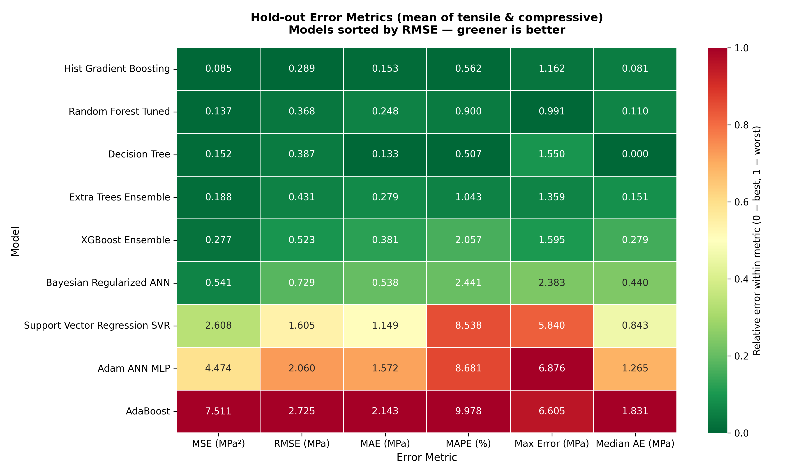
*Figure 5. Hold-out error metrics of all models (mean of both strengths). Colours are normalised within each metric: green is best, red is worst.*

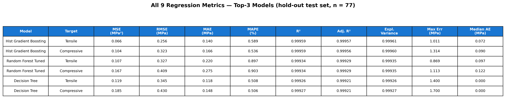
*Figure 6. All nine metrics for the three best models on the hold-out set.*

The nine metrics show different aspects of the models' behaviour, and together they justify choosing HGB:

1. **Squared-error metrics (MSE, RMSE) and the R² family.** HGB has the lowest MSE and RMSE for both strengths (Tables 3 and 4). R², adjusted R² and explained variance therefore all rank it first. Adjusted R² is only about 0.0001 lower than R² for the best models, because 77 test samples are many compared with the 5 input parameters; the high R² is not an effect of having many inputs. Explained variance is practically equal to R² for every model, which means that no model has a systematic offset (bias) in its predictions.
2. **Absolute-error metrics (MAE, median AE, MAPE).** Here the single decision tree looks slightly better than HGB, with a median absolute error of exactly 0 MPa. This is most likely a consequence of how the data are built: many test recipes fall into a leaf whose training recipes have exactly the same strength, so the tree returns that value without error. The same tree, however, has a larger maximum error (1.4 and 1.7 MPa) and a CV RMSE almost twice that of HGB (Table 2). It is right exactly or wrong by a lot, whereas HGB is consistently close.
3. **Maximum error.** The random forest has the smallest single worst error on this particular test set (0.87/1.11 MPa) because averaging 300 trees smooths extreme predictions. Under cross-validation, however, HGB has the smallest mean maximum error (1.01/1.32 MPa, see the cross-validation results below). For safety-critical parts such as a brake pedal, this worst-case error matters more than the average, and it is the reason a 2 × RMSE safety margin is used in the case studies (Section 3.6).
4. **MAPE.** The relative error weights the weakest specimens (5–10 MPa) most, because the same absolute error is a larger percentage of a small strength. AdaBoost, SVR and the Adam-ANN reach 7–10 %, so their errors are large relative to weak parts, while HGB stays below 0.6 % for both strengths.

**Table 5. Fold-by-fold 5-fold cross-validation results of HGB (tensile / compressive).**

| Fold | RMSE (MPa) | MAE (MPa) | MAPE (%) | R² |
|:--:|:--:|:--:|:--:|:--:|
| 1 | 0.256 / 0.323 | 0.140 / 0.166 | 0.589 / 0.536 | 0.9996 / 0.9996 |
| 2 | 0.398 / 0.506 | 0.219 / 0.269 | 0.822 / 0.785 | 0.9990 / 0.9990 |
| 3 | 0.198 / 0.219 | 0.130 / 0.143 | 0.654 / 0.623 | 0.9997 / 0.9998 |
| 4 | 0.227 / 0.302 | 0.134 / 0.174 | 0.573 / 0.608 | 0.9996 / 0.9996 |
| 5 | 0.167 / 0.208 | 0.125 / 0.151 | 0.655 / 0.627 | 0.9997 / 0.9997 |
| **Mean ± std** | **0.249 ± 0.080 / 0.312 ± 0.107** | **0.150 / 0.181** | **0.658 / 0.636** | **0.9995 ± 0.0003** |

Table 5 shows that HGB performs consistently in every fold: R² never drops below 0.9990, and the worst fold (fold 2) still has an RMSE of only 0.4–0.5 MPa. (Fold 1 contains the same 77 records as the hold-out test set because both use random seed 42, so its values equal those of Tables 3 and 4.) This contrasts with the base paper, which reports a mean absolute error of 5.5 for its Bayesian ANN under 5-fold cross-validation and attributes it to unstable early stopping in one fold [1].

**Table 6. 5-fold cross-validation means of the absolute-error metrics (tensile / compressive).**

| Model | MAE (MPa) | MAPE (%) | Max error (MPa) | Median AE (MPa) |
|:--|:--:|:--:|:--:|:--:|
| **HGB** | **0.150 / 0.181** | **0.66 / 0.64** | **1.01 / 1.32** | 0.080 / 0.099 |
| Extra Trees | 0.284 / 0.358 | 1.22 / 1.24 | 1.55 / 1.97 | 0.149 / 0.197 |
| Decision Tree | 0.180 / 0.228 | 0.74 / 0.75 | 1.90 / 2.40 | **0.000 / 0.000** |
| Random Forest | 0.290 / 0.365 | 1.21 / 1.23 | 1.77 / 2.24 | 0.147 / 0.187 |
| XGBoost | 0.368 / 0.461 | 2.10 / 2.11 | 1.43 / 1.78 | 0.303 / 0.372 |
| Bayesian ANN | 0.406 / 0.496 | 2.02 / 1.93 | 1.62 / 2.17 | 0.331 / 0.380 |
| SVR | 1.179 / 1.478 | 7.76 / 7.78 | 5.73 / 7.17 | 0.857 / 1.079 |
| Adam ANN | 1.227 / 1.821 | 7.33 / 8.71 | 4.61 / 6.37 | 1.035 / 1.617 |
| AdaBoost | 1.996 / 2.514 | 9.37 / 9.45 | 5.98 / 7.56 | 1.776 / 2.237 |

Table 6 confirms the hold-out findings with all 383 records. Under cross-validation, HGB has the lowest MAE, MAPE and maximum error for both strengths, and only the decision tree's median error is lower, for the reason given above. The parity plot in Figure 7 shows every hold-out prediction of HGB against the measured value. All points lie on the 1:1 line and well inside the ±10 % band, with no visible bias at low or high strengths.

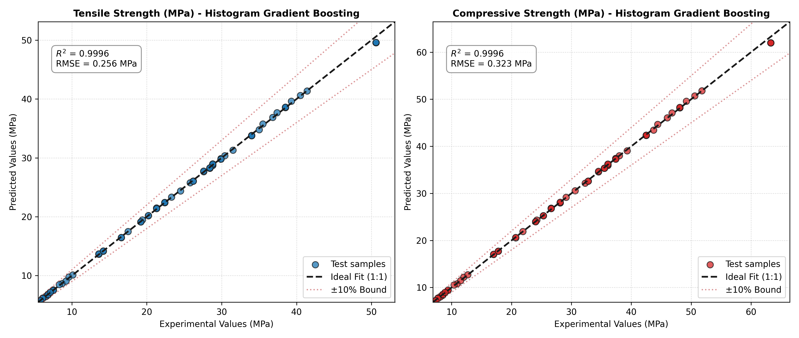
*Figure 7. Measured vs predicted strength on the hold-out test set (Histogram Gradient Boosting).*

### 3.4 Comparison with the published work

**Table 7. R² comparison with the published Table 7 of Munshi et al. [1]. Our values are R² on the hold-out test set (n = 77).**

| Model | Source of value | Tensile R² | Compressive R² |
|:--|:--|:--:|:--:|
| Adam-optimised ANN | Base paper (Taguchi L15 validation) | 0.93 | 0.98 |
| Bayesian-regularised ANN | Base paper (Taguchi L15 validation) | 0.90 | 0.95 |
| Decision tree | Base paper – other studies/datasets | 0.66 | 0.8741 |
| SVM | Base paper – other studies/datasets | 0.80 | 0.9430 |
| Random forest | Base paper – other studies/datasets | 0.74 | 0.8747 |
| XGBoost | Base paper – other studies/datasets | 0.8962 | 0.9208 |
| SVR | Base paper – other studies/datasets | 0.9215 | 0.8359 |
| k-NN | Base paper – other studies/datasets | 0.8443 | 0.9340 |
| AdaBoost | Base paper – other studies/datasets | 0.8893 | 0.9126 |
| Adam-optimised ANN | **This work (replication)** | 0.9845 | 0.9744 |
| Bayesian-regularised ANN | **This work (replication)** | 0.9975 | 0.9973 |
| Histogram gradient boosting | **This work (proposed)** | **0.9996** | **0.9996** |
| Random forest | **This work (proposed)** | 0.9993 | 0.9993 |
| XGBoost | **This work (proposed)** | 0.9986 | 0.9987 |

**Table 8. Error comparison with the published Table 4 of Munshi et al. [1]. Our values are in MPa and, in the last two columns, on normalised (min-max scaled) targets.**

| Model | Validation | Property | MSE | RMSE | MAE | MAPE (%) | RMSE (norm.) | MAE (norm.) |
|:--|:--|:--|--:|--:|--:|--:|--:|--:|
| Adam-ANN (paper) | Hold-out | Tensile | 0.0523 | 0.2031 | 0.1601 | 0.850 | – | – |
| Adam-ANN (paper) | Hold-out | Compressive | 0.0523 | 0.2516 | 0.1973 | 0.840 | – | – |
| Adam-ANN (paper) | 5-fold | Tensile | 0.0586 | 0.2126 | 0.1541 | 0.740 | – | – |
| Adam-ANN (paper) | 5-fold | Compressive | 0.0586 | 0.2661 | 0.1931 | 0.720 | – | – |
| Bayesian-ANN (paper) | Hold-out | Tensile | 0.0001 | 0.0100 | 0.0020 | 0.010 | – | – |
| Bayesian-ANN (paper) | Hold-out | Compressive | 0.0001 | 0.0077 | 0.0019 | 0.010 | – | – |
| Bayesian-ANN (paper) | 5-fold | Tensile | 1.7543 | 0.0125 | 5.5000 | 0.030 | – | – |
| Bayesian-ANN (paper) | 5-fold | Compressive | 1.6458 | 0.0120 | 5.5263 | 0.025 | – | – |
| Adam-ANN (ours) | Hold-out | Tensile | 2.5038 | 1.5823 | 1.1805 | 7.136 | 0.0353 | 0.0264 |
| Adam-ANN (ours) | Hold-out | Compressive | 6.4443 | 2.5386 | 1.9634 | 10.225 | 0.0453 | 0.0351 |
| Bayesian-ANN (ours) | 5-fold | Tensile | 0.2960 | 0.5380 | 0.4062 | 2.021 | 0.0120 | 0.0091 |
| Bayesian-ANN (ours) | 5-fold | Compressive | 0.4580 | 0.6680 | 0.4956 | 1.930 | 0.0119 | 0.0089 |
| **HGB (ours)** | Hold-out | Tensile | **0.0655** | **0.2560** | **0.1401** | **0.589** | **0.0057** | **0.0031** |
| **HGB (ours)** | Hold-out | Compressive | **0.1042** | **0.3228** | **0.1659** | **0.536** | **0.0058** | **0.0030** |
| **HGB (ours)** | 5-fold | Tensile | **0.0686** | **0.2493** | **0.1497** | **0.658** | **0.0056** | **0.0033** |
| **HGB (ours)** | 5-fold | Compressive | **0.1086** | **0.3117** | **0.1806** | **0.636** | **0.0056** | **0.0032** |

**Discussion of the comparison (Tables 7 and 8).**
1. *Replication.* Our Adam-ANN, built to the paper's description, reaches R² = 0.985/0.974, the same level as the paper's 0.93/0.98, so the replication is credible. Our Bayesian-ANN approximation is more accurate (0.997), probably because L-BFGS converges fully on this small, smooth problem.
2. *Proposed models.* All four ensembles exceed every R² in the published table. HGB reduces the RMSE of our Adam-ANN replication about six-fold (0.26 vs 1.58 MPa for tensile strength) and is also better than the Bayesian ANN.
3. *Fairness of the comparison.* The paper's ANN R² values were obtained on its own 15 Taguchi L15 prints, while ours come from held-out records of the dataset. The literature rows of the published Table 7 (decision tree, SVM, random forest, XGBoost, SVR, k-NN, AdaBoost) come from *other studies on other datasets*. Our work evaluates all models on the same data, which makes the comparison in Tables 2–6 like-for-like.
4. *Scale of the published errors.* The published error values appear to be on normalised targets, and they are internally inconsistent: an MSE of 0.0523 implies an RMSE of 0.229, not 0.2031, and an MSE of 1.75 cannot coexist with an RMSE of 0.0125. On the normalised scale, HGB's RMSE of 0.0056–0.0058 is lower than all Adam-ANN values in the paper.
5. *Why the R² values are so high.* The dataset is nearly deterministic: compressive strength is exactly 1.25 × tensile strength, bed temperature has no effect, and a depth-7 decision tree already reaches a median absolute error of 0 MPa. R² ≈ 0.9995 therefore describes the structure of this curated dataset, not the scatter expected from new physical specimens (Section 3.7).

### 3.5 Explainability: why the model predicts what it predicts

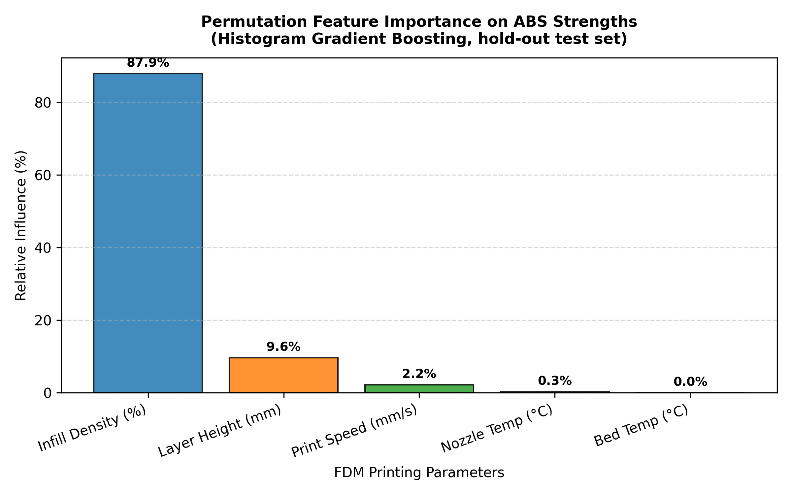
*Figure 8. Permutation importance of each parameter on the hold-out set (drop in R² when the parameter is shuffled).*

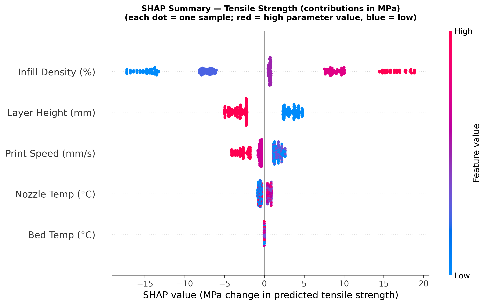
*Figure 9. SHAP beeswarm plot for tensile strength. Each dot is one record; the horizontal position is that parameter's contribution in MPa, and the colour is the parameter value (red = high, blue = low).*

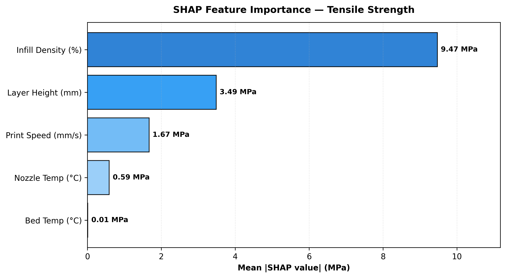
*Figure 10. Mean |SHAP| per parameter for tensile strength (MPa).*

**Table 9. Global importance: mean |SHAP| over all 383 records and permutation importance on the hold-out set.**

| Parameter | Tensile (MPa) | Share | Compressive (MPa) | Share | Permutation importance |
|:--|--:|--:|--:|--:|--:|
| Infill density | 9.47 | 62.2 % | 11.84 | 62.2 % | 87.9 % |
| Layer height | 3.49 | 22.9 % | 4.36 | 22.9 % | 9.6 % |
| Print speed | 1.67 | 11.0 % | 2.09 | 11.0 % | 2.2 % |
| Nozzle temperature | 0.59 | 3.9 % | 0.75 | 3.9 % | 0.3 % |
| Bed temperature | 0.01 | 0.1 % | 0.01 | 0.1 % | 0.0 % |

**Global explanation (Figures 8–10, Table 9).** Both methods agree on the ranking infill density > layer height > print speed > nozzle temperature > bed temperature. Permutation importance gives infill a larger share (87.9 %) than SHAP (62.2 %) because it measures the loss of R² when a parameter is destroyed, which exaggerates the dominant parameter. SHAP divides the prediction itself fairly between the parameters. The physical reading of Figure 9 is:
* **Infill density** dominates. Going from 20 % to 100 % infill moves the predicted tensile strength from about −17 MPa to about +19 MPa relative to the average. A denser infill gives a larger load-bearing cross-section and fewer internal voids.
* **Layer height** comes second. Thin 0.2 mm layers add about 2.5–5 MPa, and thick 0.8 mm layers subtract a similar amount. Thicker beads leave larger voids between them and have less contact area between layers.
* **Print speed** lowers strength above about 40 mm/s, because faster deposition leaves less time for neighbouring layers to fuse.
* **Nozzle temperature** has a small effect (below 1 MPa), with the best values in the middle of the range (about 215–245 °C).
* **Bed temperature** has no effect, in agreement with the base paper's own conclusion [1].

The SHAP dependence analysis also reveals an interaction: with thin 0.2 mm layers, the effect of infill is amplified in both directions (a larger gain at 80–100 % infill and a larger penalty at 20–40 %).

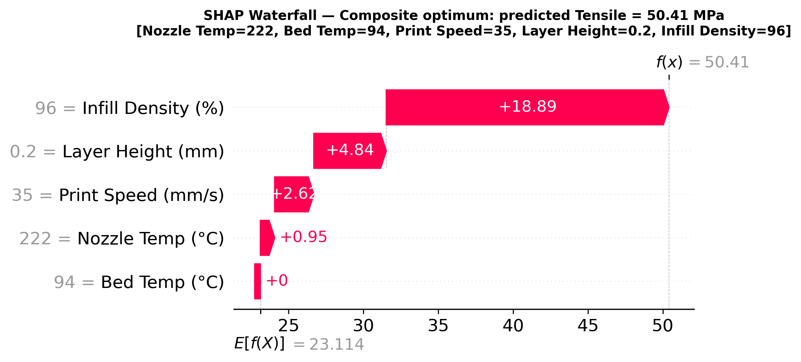
*Figure 11. Explanation of a single prediction: why the optimal recipe is predicted to reach 50.41 MPa tensile strength.*

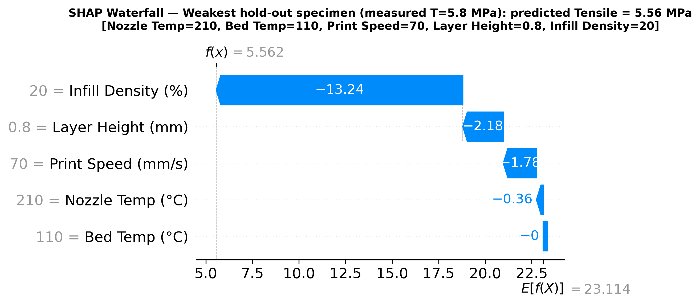
*Figure 12. Explanation of the weakest hold-out specimen (measured 5.8 MPa, predicted 5.56 MPa).*

**Local explanation (Figures 11 and 12).** Every prediction can be split into exact MPa contributions. For the optimal recipe (222 °C, 94 °C, 35 mm/s, 0.2 mm, 96 %), Figure 11 reads:

> 23.11 MPa (dataset average) + 18.89 (infill 96 %) + 4.84 (layer 0.2 mm) + 2.62 (speed 35 mm/s) + 0.95 (nozzle 222 °C) + 0.00 (bed 94 °C) = **50.41 MPa**.

The weakest test specimen (210 °C, 110 °C, 70 mm/s, 0.8 mm, 20 %) is predicted at 5.56 MPa against a measured 5.8 MPa (Figure 12). Its low infill alone removes 13.2 MPa, and thick layers (−2.2 MPa) and high speed (−1.8 MPa) explain most of the rest. These explanations answer *why* a recipe is strong or weak, and they show which parameter to change first: infill, then layer height, then speed.

### 3.6 Optimal parameters, sensitivity and automotive case studies

**Table 10. Robust optimum (worst case within ±5 °C, ±5 mm/s and ±5 % infill; machine-rounded).**

| Objective | Nozzle (°C) | Bed (°C) | Speed (mm/s) | Layer (mm) | Infill (%) | σt (MPa) | σc (MPa) | Worst-case σt / σc (MPa) | τ |
|:--|--:|--:|--:|--:|--:|--:|--:|:--:|--:|
| Max tensile | 228 | 86 | 35 | 0.2 | 96 | 50.41 | 63.04 | 50.41 / 63.02 | 138.9 |
| Max compressive | 226 | 73 | 35 | 0.2 | 96 | 50.41 | 63.04 | 50.41 / 63.02 | 138.9 |
| Max composite | 222 | 94 | 35 | 0.2 | 96 | 50.41 | 63.02 | 50.41 / 63.02 | 138.9 |
| Best of 960 tested combinations (exhaustive check) | 230 | 90 | 30 | 0.2 | 100 | 50.41 | 63.04 | – | 166.7 |

Table 10 shows that all three objectives lead to the same optimum. This is expected, because σc ≈ 1.25·σt, so maximising one strength maximises the other. The optimiser matches the strength of the exhaustive-search optimum while printing 17 % faster (τ = 138.9 vs 166.7), because it finds that 35 mm/s and 96 % infill are as strong as 30 mm/s and 100 %. The worst-case strength equals the nominal strength, so the recipe stays at full strength even if the machine drifts by ±5 units. The nozzle and bed values differ between the objectives only because the strength is flat in those parameters near the optimum.

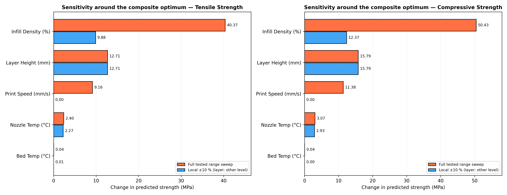
*Figure 13. Sensitivity around the composite optimum: change in strength over the full tested range and for a local ±10 % change of each parameter.*

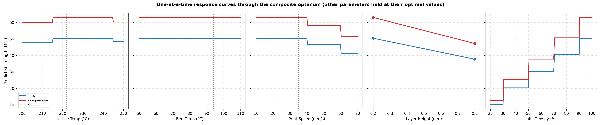
*Figure 14. One-at-a-time response curves through the optimum (other parameters held at their optimal values).*

**Table 11. Sensitivity around the composite optimum.**

| Parameter | Full-range swing σt (MPa) | Full-range swing σc (MPa) | Local ±10 % change σt (MPa) | Near-optimal window (≥ 99 % of optimum) |
|:--|--:|--:|--:|:--|
| Infill density | 40.37 | 50.43 | 9.89 | 90.5 – 100 % |
| Layer height | 12.71 | 15.79 | 12.71 (0.2 → 0.8 mm) | 0.2 mm only |
| Print speed | 9.16 | 11.38 | 0.00 | 10 – 40 mm/s |
| Nozzle temperature | 2.40 | 3.07 | 2.27 | 215 – 245 °C |
| Bed temperature | 0.04 | 0.04 | 0.01 | 50 – 110 °C (no effect) |

Figures 13 and 14 and Table 11 show how sensitive the optimum is to each parameter. Strength is very sensitive to infill (a 40 MPa swing over the range) and layer height (13 MPa), moderately sensitive to speed (9 MPa), and almost insensitive to the temperatures. The step shapes in Figure 14 are the tested levels of the data. **Recommended maximum-strength window:** layer height 0.2 mm, infill ≥ 95 %, print speed ≤ 35 mm/s, nozzle temperature 220–240 °C, and any bed temperature in 50–110 °C (chosen for warping control). The response surfaces in Figure 15 show the same picture over infill and nozzle temperature for both layer heights.

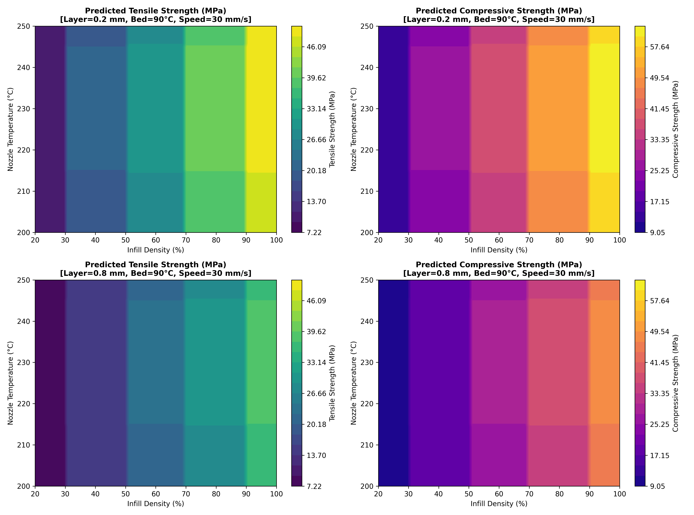
*Figure 15. Predicted strength over infill density × nozzle temperature for both tested layer heights (bed 90 °C, speed 30 mm/s).*

**Table 12. Fastest recipes that meet each requirement in the worst case, plus a model-error margin of 2 × CV RMSE.**

| Component | Requirement | Nozzle (°C) | Bed (°C) | Speed (mm/s) | Layer (mm) | Infill (%) | σt (MPa) | σc (MPa) | Worst case (MPa) | τ | Print-time saving* |
|:--|:--|--:|--:|--:|--:|--:|--:|--:|--:|--:|--:|
| Brake pedal | σc ≥ 45 MPa (+0.62) | 224 | 76 | 35 | 0.8 | 96 | 37.72 | **47.27** | σc = 47.23 | 34.7 | 75.0 % |
| Door handle | σt ≥ 30 MPa (+0.50) | 225 | 85 | 70 | 0.8 | 96 | **30.78** | 38.55 | σt = 30.78 | 17.4 | 87.5 % |

\*Compared with the maximum-strength recipe (τ = 138.9).

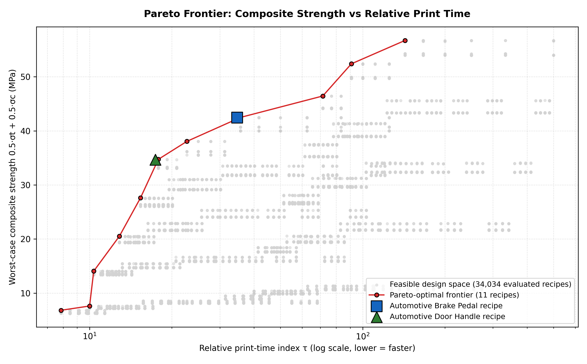
*Figure 16. Pareto front of worst-case composite strength vs relative print time; the two case-study recipes are marked.*

Table 12 shows that both automotive parts can be printed with **thick 0.8 mm layers and high infill**. Thick layers cost about 13 MPa of strength compared with 0.2 mm layers, but they reduce the print time by about a factor of four. The brake pedal needs high compressive strength, so it uses a moderate speed (35 mm/s) and keeps σc = 47.2 MPa with a safety factor of 1.05. The door handle's lower requirement allows the maximum tested speed (70 mm/s). The Pareto front in Figure 16 (11 non-dominated recipes) shows the full trade-off. Up to τ ≈ 36, strength rises steeply as infill is increased and speed reduced at 0.8 mm layers, up to about 42.5 MPa composite strength. Beyond this "knee", further gains require 0.2 mm layers, which at least double the print time. The brake-pedal recipe sits close to this knee, where extra strength starts to become expensive in print time.

### 3.7 Taguchi L15 check and limitations
The model was also applied to the 15 Taguchi L15 combinations of the base paper. For the two strongest combinations (6: 225 °C, 110 °C, 10 mm/s, 0.2 mm, 100 %; 13: 225 °C, 50 °C, 40 mm/s, 0.2 mm, 100 %), the model predicts about 50.4/63.0 MPa. The paper reports about 37/52 MPa and 35/47 MPa for these prints. The ranking agrees (they are also the paper's two strongest combinations), but the paper's own prints are 25–30 % weaker than anything a model trained on the compiled dataset predicts, with a compressive-to-tensile ratio of about 1.4 instead of 1.25.

**Limitations.**
1. The dataset was compiled from the literature and is nearly deterministic, so the very high R² values should not be read as the accuracy expected on new physical prints.
2. The paper's L15 measurements are shown only graphically, so a true external validation was not possible; the gap described above suggests a systematic offset between the compiled data and the authors' own prints.
3. Predictions between tested levels (e.g. 35 mm/s, 96 % infill or a 0.5 mm layer) are interpolations. The robust optimisation and the safety margins reduce, but do not remove, this risk.
4. The print-time index is a relative indicator that depends on an assumed shell fraction.
5. The recommended recipes should be confirmed with a few physical ASTM D638/D695 test prints before production use.

### 3.8 Interactive simulator
Figure 17 shows the interactive simulator built from the final model. The user sets the five printing parameters and immediately sees:
* the predicted and worst-case tensile and compressive strengths, and the print time;
* the closest real record in the dataset with its measured strengths;
* a live Shapley explanation of the prediction;
* virtual load tests of the brake pedal and the door handle.

The optimiser can also be run live on the Pareto map. Automated tests confirm that the simulator reproduces the Python model to within 2.4 × 10⁻¹¹ MPa on 500 recipes, and that its optimiser reached the optima of Table 12 in all 180 test runs.

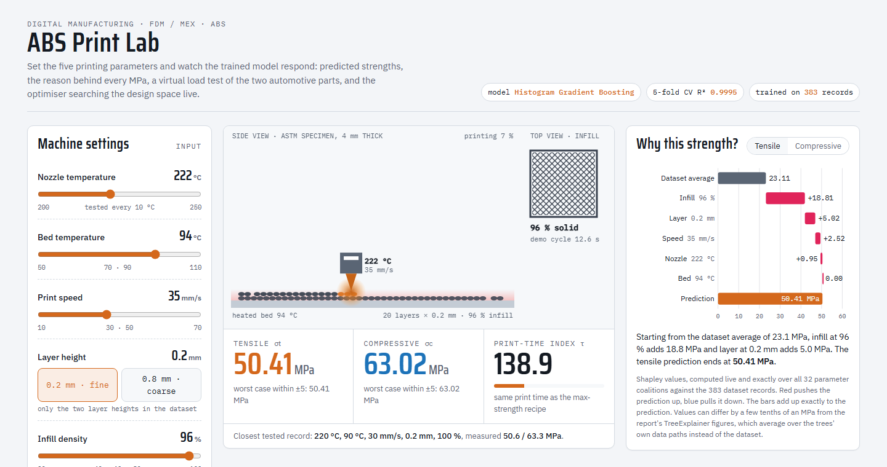
*Figure 17. The interactive simulator ("ABS Print Lab"): machine settings, animated print view with predicted strengths, and a live Shapley explanation of the current recipe.*

---

## 4. Conclusion
1. The base paper's ANN models were replicated on its openly published 383-record dataset. The Adam-ANN replication (R² ≈ 0.98) matches the paper's reported performance.
2. Of nine models evaluated with nine metrics, histogram-based gradient boosting gave the most accurate and most stable predictions: 5-fold CV R² = 0.9995 for both strengths, RMSE of 0.25 MPa (tensile) and 0.31 MPa (compressive), MAPE of about 0.65 % and the smallest cross-validated maximum error (about 1.0–1.3 MPa). Explained variance equal to R² shows that it has no systematic bias, and its fold-to-fold variation is very small.
3. The comparison of metrics showed why a single metric is not enough: the decision tree has a median error of 0 MPa but a much larger maximum error, and permutation importance overstates the dominant parameter compared with SHAP.
4. SHAP turns each prediction into exact MPa contributions. Infill density (≈ 62 %), layer height (≈ 23 %) and print speed (≈ 11 %) govern strength, nozzle temperature matters little, and bed temperature does not matter inside the tested window.
5. Robust differential evolution, verified by exhaustive search, identifies the maximum-strength window (0.2 mm layers, ≥ 95 % infill, ≤ 35 mm/s), giving about 50.4 MPa tensile and 63.0 MPa compressive strength. Constrained optimisation gives a brake-pedal recipe (σc ≈ 47 MPa) and a door-handle recipe (σt ≈ 31 MPa) that cut print time by 75 % and 87.5 %.
6. Future work: physical validation prints with replicates, data at intermediate layer heights (0.4–0.5 mm), and replacing the print-time index with slicer-based estimates of time, energy and cost.

---

## References
1. G.A. Munshi, V.M. Kulkarni, S. Yargatti, Computation of tensile and compressive strengths of additively manufactured ABS material for automotive applications using ANN algorithms, *Next Materials* 10 (2026) 101420. https://doi.org/10.1016/j.nxmate.2025.101420
2. A.K. Sood, R.K. Ohdar, S.S. Mahapatra, Parametric appraisal of mechanical property of fused deposition modelling processed parts, *Materials & Design* 31(1) (2010) 287–295. https://doi.org/10.1016/j.matdes.2009.06.016
3. A. Alafaghani, A. Qattawi, B. Alrawi, A. Guzman, Experimental optimization of fused deposition modelling processing parameters: a design-for-manufacturing approach, *Procedia Manufacturing* 10 (2017) 791–803. https://doi.org/10.1016/j.promfg.2017.07.079
4. O.A. Mohamed, S.H. Masood, J.L. Bhowmik, Optimization of fused deposition modeling process parameters: a review of current research and future prospects, *Advances in Manufacturing* 3(1) (2015) 42–53. https://doi.org/10.1007/s40436-014-0097-7
5. F. Rayegani, G.C. Onwubolu, Fused deposition modelling (FDM) process parameter prediction and optimization using group method for data handling (GMDH) and differential evolution (DE), *International Journal of Advanced Manufacturing Technology* 73 (2014) 509–519. https://doi.org/10.1007/s00170-014-5835-2
6. L. Meng, B. McWilliams, W. Jarosinski, H.-Y. Park, Y.-G. Jung, J. Lee, J. Zhang, Machine learning in additive manufacturing: a review, *JOM* 72(6) (2020) 2363–2377. https://doi.org/10.1007/s11837-020-04155-y
7. G.D. Goh, S.L. Sing, W.Y. Yeong, A review on machine learning in 3D printing: applications, potential, and challenges, *Artificial Intelligence Review* 54 (2021) 63–94. https://doi.org/10.1007/s10462-020-09876-9
8. G.A. Munshi, V.M. Kulkarni, S. Yargatti, Printing parameters, tensile and compressive strengths of acrylonitrile-butadiene-styrene – Experimental dataset [dataset], Zenodo, version 4 (2025). https://doi.org/10.5281/zenodo.15449938
9. L. Breiman, Random forests, *Machine Learning* 45 (2001) 5–32. https://doi.org/10.1023/A:1010933404324
10. G. Ke, Q. Meng, T. Finley, T. Wang, W. Chen, W. Ma, Q. Ye, T.-Y. Liu, LightGBM: a highly efficient gradient boosting decision tree, *Advances in Neural Information Processing Systems* 30 (2017) 3146–3154.
11. T. Chen, C. Guestrin, XGBoost: a scalable tree boosting system, *Proceedings of the 22nd ACM SIGKDD International Conference on Knowledge Discovery and Data Mining* (2016) 785–794. https://doi.org/10.1145/2939672.2939785
12. S.M. Lundberg, S.-I. Lee, A unified approach to interpreting model predictions, *Advances in Neural Information Processing Systems* 30 (2017) 4765–4774.
13. R. Storn, K. Price, Differential evolution – a simple and efficient heuristic for global optimization over continuous spaces, *Journal of Global Optimization* 11 (1997) 341–359. https://doi.org/10.1023/A:1008202821328
14. F. Pedregosa et al., Scikit-learn: machine learning in Python, *Journal of Machine Learning Research* 12 (2011) 2825–2830.
15. P. Virtanen et al., SciPy 1.0: fundamental algorithms for scientific computing in Python, *Nature Methods* 17 (2020) 261–272. https://doi.org/10.1038/s41592-019-0686-2
16. ASTM D638-14, Standard Test Method for Tensile Properties of Plastics, ASTM International, West Conshohocken, PA, 2014.
17. ASTM D695-15, Standard Test Method for Compressive Properties of Rigid Plastics, ASTM International, West Conshohocken, PA, 2015.
