# ABS Print Lab: Complete User Guide

**What it is:** an interactive simulator of our project's trained machine-learning model. It runs in any web browser, fully offline. You set the five 3D-printing parameters, and the page instantly shows:
- the predicted tensile and compressive strength of the printed ABS part
- why the model predicts that value
- whether the brake pedal and the door handle from the reference paper would survive their loads
- how the optimiser finds the best recipe

**File to open:** `simulator/ABS_Print_Lab.html`. Double-click it to open it in Chrome or Microsoft Edge. No installation, no Python and no internet are needed.

---

## 1. What is behind the simulator

* The page contains the **exact model from our Python pipeline**: Histogram Gradient Boosting with 300 boosted decision trees per strength, trained on all 383 dataset records. It is not an approximation. An automated check (`test_runtime.js`) confirms that the browser's predictions equal Python's to within 0.00000000003 MPa on 500 test recipes.
* All calculations run on your computer, inside the browser.
* The model has a cross-validated accuracy of R² = 0.9995. Typical errors are 0.25 MPa (tensile) and 0.31 MPa (compressive).
* Every number on the page comes from this model. The animations (the printer, the load test) are visualisations of those numbers. They are not physics or finite-element simulations.

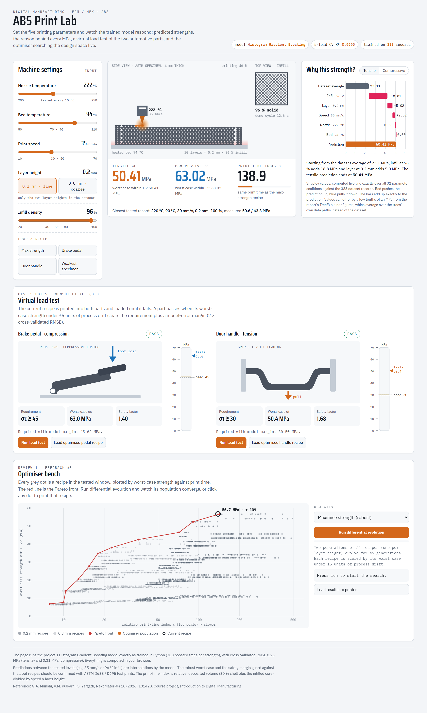
*Figure 1. The whole simulator. Top row: machine settings, print view, explanation. Middle: virtual load test. Bottom: optimiser bench.*

The page has four areas, read top to bottom:

| Area | Question it answers | Review 1 link |
|:--|:--|:--|
| ① Machine settings + print view + readouts | "If I print with these settings, how strong is the part?" | prediction |
| ② Why this strength? | "Why does the model predict this number?" | feedback #2 (explainability) |
| ③ Virtual load test | "Would the brake pedal / door handle survive?" | case studies of the paper |
| ④ Optimiser bench | "What are the best settings?" | feedback #3 (optimal parameters) |

---

## 2. Header

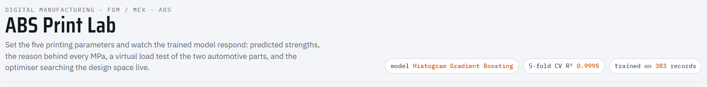
*Figure 2. Header chips.*

The three chips on the right state which model is running (Histogram Gradient Boosting), its 5-fold cross-validated R² (0.9995), and the number of training records (383).

---

## 3. Machine settings (left panel)

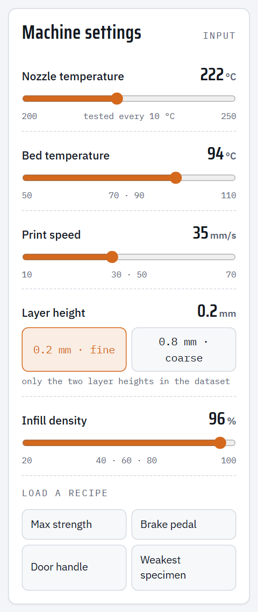
*Figure 3. The five printing parameters and the recipe buttons.*

| Control | Range | Tested levels in the data | What it does physically |
|:--|:--|:--|:--|
| **Nozzle temperature** (slider) | 200–250 °C | every 10 °C | Hotter plastic flows better and bonds better between beads |
| **Bed temperature** (slider) | 50–110 °C | 50, 70, 90, 110 | Reduces warping; almost no effect on strength in this data |
| **Print speed** (slider) | 10–70 mm/s | 10, 30, 50, 70 | Faster printing leaves less time for layers to fuse |
| **Layer height** (two buttons) | 0.2 or 0.8 mm | only these two | Thicker layers print faster but leave larger voids |
| **Infill density** (slider) | 20–100 % | 20, 40, 60, 80, 100 | How solid the inside of the part is; the biggest effect on strength |

* The small grey numbers under each slider are the levels that were actually tested in the dataset. Values between them (for example 35 mm/s) are **interpolated** by the model.
* Layer height is two buttons instead of a slider because the dataset only contains 0.2 mm and 0.8 mm layers. The simulator never asks the model about a layer height it has not seen.
* The sliders also work with the keyboard: click a slider, then use the arrow keys.

**Load a recipe** buttons set all five parameters at once:

| Button | Settings (nozzle, bed, speed, layer, infill) | Where it comes from |
|:--|:--|:--|
| **Max strength** | 222 °C, 94 °C, 35 mm/s, 0.2 mm, 96 % | Robust optimum from `optimal_parameters.csv` |
| **Brake pedal** | 224 °C, 76 °C, 35 mm/s, 0.8 mm, 96 % | Fastest recipe with σc ≥ 45 MPa (case study) |
| **Door handle** | 225 °C, 85 °C, 70 mm/s, 0.8 mm, 96 % | Fastest recipe with σt ≥ 30 MPa (case study) |
| **Weakest specimen** | 210 °C, 110 °C, 70 mm/s, 0.8 mm, 20 % | The weakest record in the dataset (measured 5.8 MPa tensile) |

The page opens on the **Max strength** recipe.

---

## 4. Print view and readouts (centre panel)

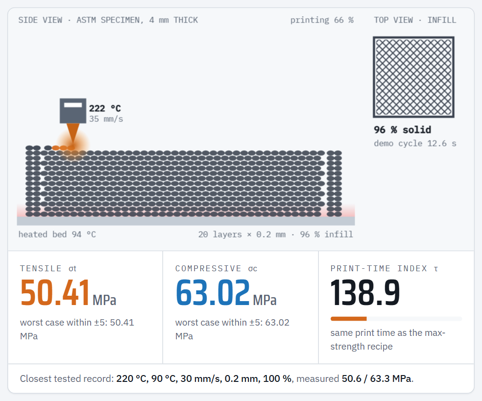
*Figure 4. Animated print view (top) and the three result readouts (bottom).*

### 4.1 The animated print view
This is a visual representation of the specimen being printed with the current settings:

* **Side view (left).** A 4 mm-thick specimen is built bead by bead and layer by layer.
  * **Layer height** changes the bead size: 0.2 mm gives 20 thin layers, 0.8 mm gives 5 thick ones (compare Figure 4 with Figure 14).
  * **Infill** changes the gaps between beads inside the part. The outer walls (2 beads) and the first and last layers are always solid, as in a real slicer.
  * The freshly deposited beads glow **orange** (hot plastic).
* **Nozzle.** The block with the triangular tip is the print head. Its tip colour gets brighter with **nozzle temperature**, and its labels show the temperature and speed.
* **Bed.** The grey bar at the bottom is the build plate. The pink glow above it gets stronger with **bed temperature**.
* **Top view (right).** The infill pattern: lines are dense at high infill and sparse at low infill.
* **Demo cycle.** The animation's length is proportional to the print-time index τ (cycle = τ/11 seconds). Slow recipes visibly print slowly, fast ones quickly.
* **Progress text** (top right of the side view) shows "printing xx %" and then "specimen complete".

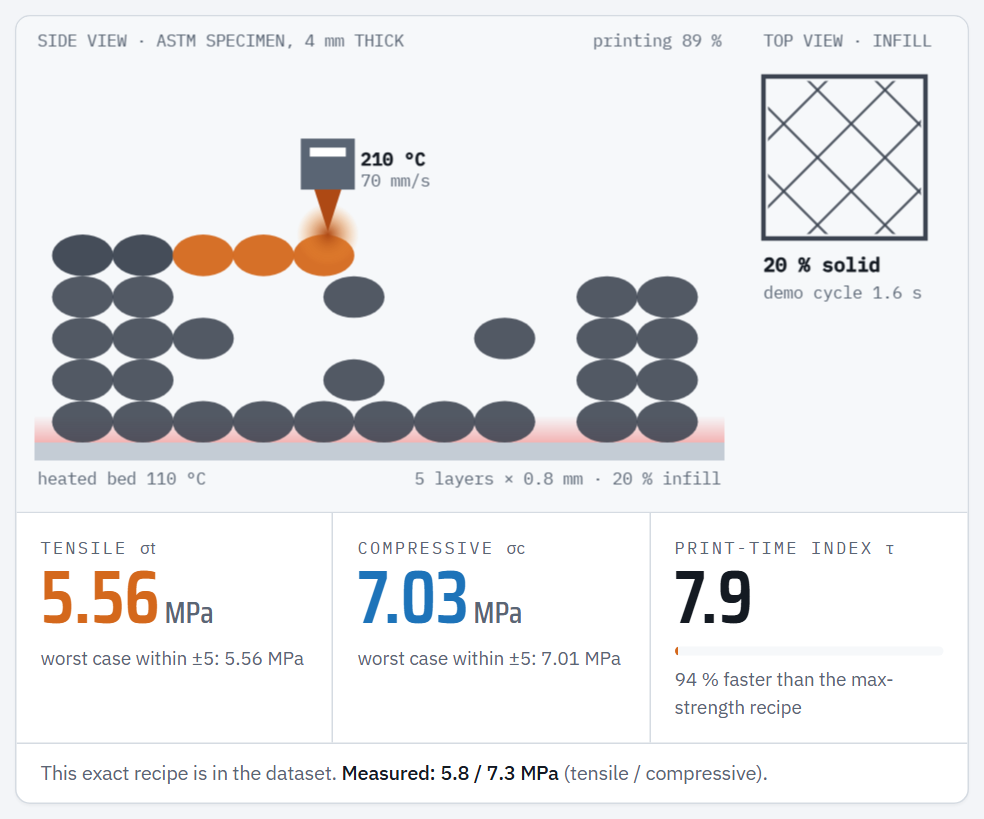
*Figure 5. The weakest specimen: 20 % infill and 0.8 mm layers leave large gaps, giving a very weak part.*

### 4.2 The readouts

| Readout | Meaning |
|:--|:--|
| **Tensile σt** (orange, MPa) | Predicted tensile strength: the stress at which the part breaks when pulled (ASTM D638). |
| **Compressive σc** (blue, MPa) | Predicted compressive strength: the stress at which the part fails when squeezed (ASTM D695). |
| **worst case within ±5** | The **lowest** strength the model predicts if the real machine drifts by up to ±5 °C, ±5 mm/s or ±5 % infill from the set values. The model checks all 81 combinations of drift. If this equals the main number, the recipe is robust. If it is much lower, the recipe sits on a "cliff" where a small error loses strength. |
| **Print-time index τ** | A relative print time (lower = faster). τ = 1000 × (0.3 + 0.7 × infill/100) / (speed × layer height). It assumes 30 % of the part is shell (walls/top/bottom). Use it to compare recipes, not as minutes. |
| **Bar and text under τ** | Compares the current recipe with the max-strength recipe (τ = 138.9). For example, "75 % faster than the max-strength recipe", or "2.10 × the time …". |
| **Closest tested record** (bottom line) | The nearest real record in the dataset and its **measured** strengths, so you can compare the prediction with real data. If the recipe is exactly in the dataset, it says so. |

---

## 5. "Why this strength?" (right panel), Review 1 feedback #2

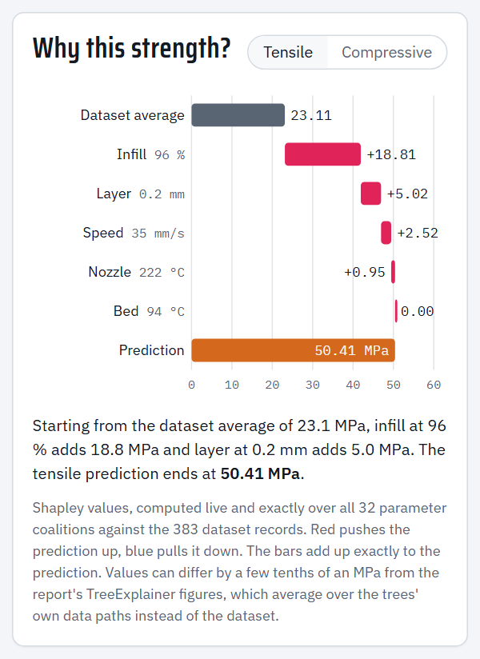
*Figure 6. Shapley explanation of the max-strength recipe (tensile).*

This chart explains **one prediction**: the one for the current recipe. It answers exactly what the professor asked in Review 1: *"Explainability of the result we got for a prediction."*

**How to read it (a "waterfall" chart):**
1. **Dataset average** (grey bar) is the starting point: the average predicted tensile strength over all 383 records, 23.11 MPa.
2. Each following row is one parameter. Its bar shows how many **MPa that parameter adds (red) or removes (blue)** for this specific recipe. Rows are sorted from the largest effect to the smallest.
3. **Prediction** (orange bar for tensile, blue for compressive) is where you end up. The bars always add up **exactly** to the prediction.

**Example, max-strength recipe (tensile):**

> 23.11 (average) + 18.81 (infill 96 %) + 5.02 (layer 0.2 mm) + 2.52 (speed 35 mm/s) + 0.95 (nozzle 222 °C) + 0.00 (bed 94 °C) = **50.41 MPa**

In words: the high infill alone adds almost 19 MPa above an average part; thin layers add 5 MPa, a moderate speed adds 2.5 MPa, and the bed temperature adds nothing.

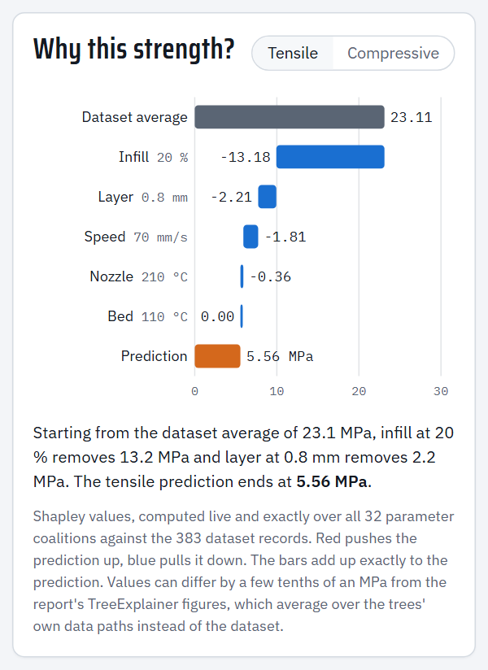
*Figure 7. The same chart for the weakest specimen: low infill removes 13.2 MPa, thick layers 2.2 MPa and high speed 1.8 MPa.*

* The **Tensile / Compressive** toggle switches which strength is explained.

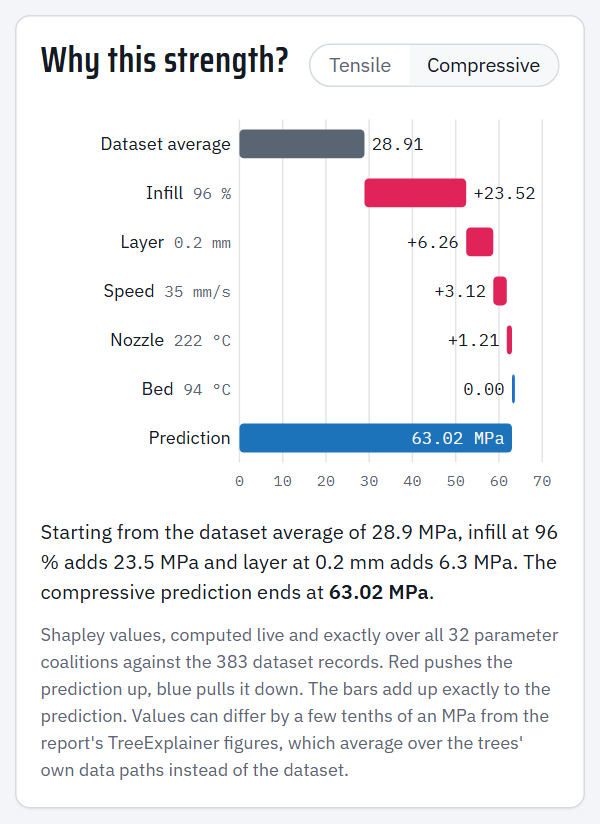
*Figure 8. Compressive explanation for the same recipe (the shares are the same as for tensile, because σc ≈ 1.25 × σt in this data).*

* The sentence under the chart summarises the two biggest effects in plain language.
* When you change a setting, the chart greys out with "· updating…" for about half a second while it recalculates. This is normal.
* **Method (for questions):** these are exact Shapley values from cooperative game theory. All 2⁵ = 32 combinations of "parameter known / unknown" are evaluated, and the unknown parameters are averaged over the 383 dataset records. The report's SHAP figures use TreeExplainer, which averages over the trees' internal paths instead, so the two can differ by a few tenths of an MPa (for example +18.81 here vs +18.89 in the report). Both rank the parameters the same way.

---

## 6. Virtual load test (middle section), case studies

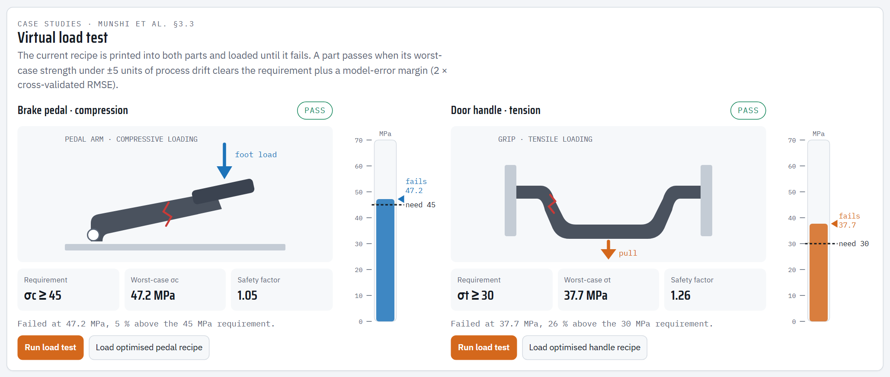
*Figure 9. Brake pedal recipe after running both load tests. Both parts pass; the red crack marks where they finally fail.*

The **current recipe** is "printed" into the two automotive parts from the reference paper (Munshi et al., Section 3.3):

| Part | Load type | Requirement |
|:--|:--|:--|
| **Brake pedal** | compression (foot load) | σc ≥ 45 MPa |
| **Door handle** | tension (pull) | σt ≥ 30 MPa |

### 6.1 The verdict badge (top right of each part)
* **PASS (green):** the worst-case strength is at least the requirement **plus a safety margin**. The margin is 2 × the model's cross-validated error: +0.62 MPa for the pedal, +0.50 MPa for the handle.
* **WITHIN MARGIN (amber):** the requirement is met, but by less than the safety margin. Treat it as borderline.
* **FAIL (red):** the worst-case strength is below the requirement.

### 6.2 The three boxes under each part
* **Requirement:** the target, e.g. σc ≥ 45.
* **Worst-case σc / σt:** the strength used for the decision (see Section 4.2).
* **Safety factor:** worst-case strength ÷ requirement. Above 1.00, the part is stronger than required. Examples: 1.05 for the optimised pedal, 1.40 for the pedal printed with the max-strength recipe.

### 6.3 The gauge (vertical bar next to each part)
* Scale 0–70 MPa.
* **Dashed black line "need 45/30":** the requirement.
* **Faint amber band just above it:** the safety margin.
* **Coloured triangle "fails xx.x":** the strength at which this recipe fails.
* While the test runs, the coloured fill rises as the load increases.

### 6.4 Running a test
Press **Run load test**:
1. The load arrow pushes (pedal) or pulls (handle), and the gauge fills up.
2. When the stress passes the requirement, the message says "Requirement of 45 MPa reached and held. Increasing load…".
3. The load keeps increasing until the predicted strength is reached. Then a **red crack** appears, and the message gives the failure stress and how far above (or below) the requirement it was.

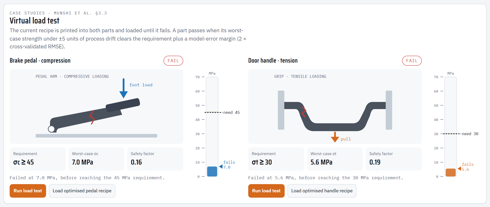
*Figure 10. The weakest specimen fails both parts long before their requirements.*

* **Load optimised pedal / handle recipe** loads the optimised recipe for that part into the machine settings.
* Changing any setting during a test stops the test and resets the rig. Pressing Run again restarts it cleanly.

---

## 7. Optimiser bench (bottom section), Review 1 feedback #3

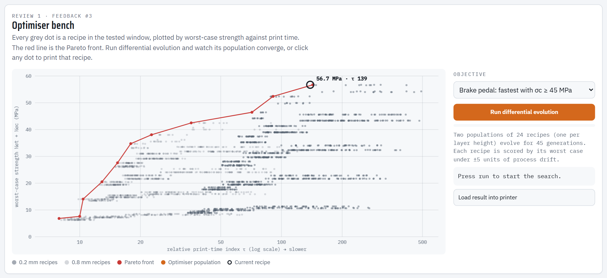
*Figure 11. The design-space map before a run.*

### 7.1 Reading the map
* **Horizontal axis:** print-time index τ on a logarithmic scale. Further right is slower.
* **Vertical axis:** worst-case composite strength = ½ σt + ½ σc (MPa). Higher is stronger.
* **Grey dots:** 2,500 possible recipes inside the tested window. Darker dots use 0.2 mm layers, lighter dots 0.8 mm.
* **Red line with dots, the Pareto front:** the best possible trade-offs. For each print time, no recipe is stronger than the front. Points below it are "wasteful": a recipe exists that is both stronger and faster.
* **Black ring, the current recipe:** shows where the recipe in the machine settings sits, with its strength and τ.
* **Clicking any dot** loads that recipe into the printer. Try clicking points along the red line and watch the print view and the load tests change.

### 7.2 Running the optimiser
1. Choose an **Objective**:
   * *Maximise strength (robust)*: the strongest recipe (worst case), with the fastest print time as a tie-breaker.
   * *Brake pedal: fastest with σc ≥ 45 MPa*: the shortest print time whose worst-case compressive strength meets 45 MPa + margin.
   * *Door handle: fastest with σt ≥ 30 MPa*: the same for tensile strength and 30 MPa.
2. Press **Run differential evolution**.

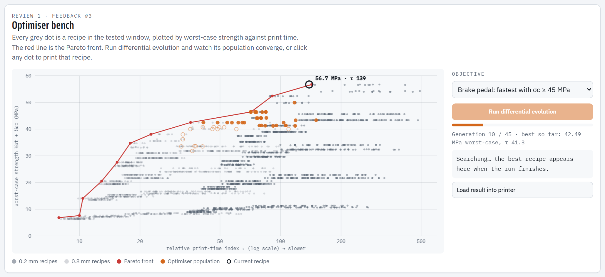
*Figure 12. Mid-run: orange dots are candidate recipes moving towards the best region. Hollow dots do not yet meet the requirement.*

What you see:
* **Orange dots:** two populations of 24 candidate recipes, one for each layer height, as in the Python optimiser. Every generation, each candidate is mixed with others (mutation and crossover). It is replaced only if the new recipe scores better. **Filled** dots meet the goal; **hollow** dots do not yet.
* **Progress bar and status line:** generation number (out of 45) and the best result so far.
* During the search, each candidate is scored by its worst case under drift. The final result is checked against all 81 drift scenarios.

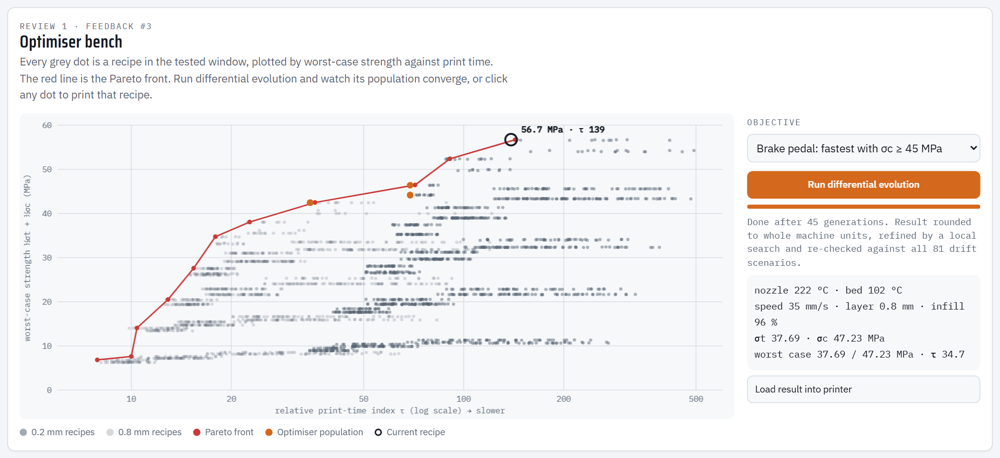
*Figure 13. After 45 generations: the population has collapsed onto the Pareto front, and the result box shows the recipe.*

3. When it finishes (about 3–5 s), the result is **rounded to whole machine units** (1 °C, 1 mm/s, 1 %) and refined with a short local search. The result box shows the settings, the predicted σt and σc, the worst case and τ.
4. Press **Load result into printer** to send it to the machine settings, as in Figure 14.

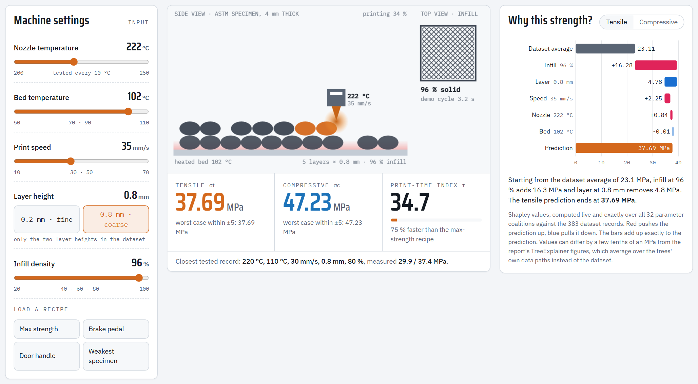
*Figure 14. The brake-pedal optimum loaded into the printer: 35 mm/s, 0.8 mm layers, 96 % infill, σc = 47.23 MPa worst case, 75 % faster than the max-strength recipe.*

**Expected results.** These are the same as the Python pipeline and the report:

| Objective | Speed | Layer | Infill | Strength (worst case) | τ |
|:--|--:|--:|--:|:--|--:|
| Maximise strength | 35 mm/s | 0.2 mm | 96 % | σt 50.41, σc 63.02 MPa | 138.9 |
| Brake pedal | 35 mm/s | 0.8 mm | 96 % | σc ≈ 47.2 MPa (≥ 45.62 needed) | 34.7 |
| Door handle | 70 mm/s | 0.8 mm | 96 % | σt ≈ 30.8 MPa (≥ 30.50 needed) | 17.4 |

> The nozzle and bed temperatures in the result change from run to run (for example 222 °C one time, 236 °C the next). This is expected: strength is flat over 215–245 °C nozzle and over the whole bed range, so any value there is equally good. The speed, layer, infill, strength and print time come out the same every time. We tested 180 optimiser runs with different random seeds, and all of them found the optimum.

---

## 8. Suggested 5-minute demonstration for the professor

1. **Open** the file. Point at the header: "This is our trained Histogram Gradient Boosting model, R² 0.9995, running live."
2. **Prediction:** click **Max strength**. "Thin layers, 96 % infill, 35 mm/s gives 50.4 MPa tensile and 63.0 MPa compressive." Point at the closest tested record (50.6 / 63.3 MPa measured).
3. **Explainability (feedback #2):** walk through the waterfall: "23.1 MPa average + 18.8 from infill + 5.0 from thin layers + 2.5 from speed + 1.0 from nozzle = 50.41." Then click **Weakest specimen** and show that infill now removes 13 MPa.
4. **Interactive:** drag the **Infill** slider down slowly. Strength drops in steps, the print view shows the gaps opening, and the load-test verdicts turn from PASS to FAIL.
5. **Case studies:** click **Brake pedal**, press both **Run load test** buttons. "With thick 0.8 mm layers the pedal still passes 45 MPa with a 1.05 safety factor, and prints 75 % faster."
6. **Optimisation (feedback #3):** choose *Brake pedal* in the optimiser, press **Run differential evolution**, let the audience watch the dots converge onto the red Pareto front, then press **Load result into printer**. "The optimiser independently finds the same recipe as our Python pipeline."
7. **Close:** "Everything is computed from the same model as the report; the browser model is verified to match Python exactly."

---

## 9. Glossary

| Term | Meaning |
|:--|:--|
| σt (sigma-t) | Tensile strength in MPa (1 MPa = 1 N/mm²) |
| σc (sigma-c) | Compressive strength in MPa |
| τ (tau) | Relative print-time index (lower = faster); compare recipes only |
| Worst case within ±5 | Lowest predicted strength if the machine drifts ±5 °C / ±5 mm/s / ±5 % infill |
| Safety margin | 2 × cross-validated RMSE of the model (0.50 MPa tensile, 0.62 MPa compressive), added to each requirement |
| Safety factor | Worst-case strength ÷ requirement |
| Shapley value | The fair share of a prediction attributed to one parameter (game theory); the shares add up to the prediction |
| Pareto front | The set of recipes where you cannot gain strength without losing speed |
| Differential evolution | A population-based optimisation method: candidates are mutated and mixed, and better ones survive |
| Composite strength | ½ σt + ½ σc, used for a single strength score on the map |
| Interpolation | A prediction between tested levels (e.g. 35 mm/s), estimated by the model |

---

## 10. Questions the professor may ask

* **"Is this the real model or a mock-up?"** The real one. `build_simulator.py` exports the 600 trained trees from Python into the page. `test_runtime.js` proves that the predictions match to within 10⁻¹⁰ MPa. The animations are only visualisations of the model's numbers.
* **"Why does strength change in steps when I move a slider?"** The model is made of decision trees, which are piecewise-constant. The data only has a few tested levels per parameter, so the model changes its prediction between those levels. That is also why the optimiser scores recipes by their worst case: it avoids recipes sitting exactly on a step.
* **"Why does the bed temperature do nothing?"** In this dataset, bed temperature has no measurable effect on strength (correlation r = 0.04; Shapley contribution ≈ 0 MPa). This matches the paper's own conclusion.
* **"Why are tensile and compressive always proportional?"** In the dataset, σc = 1.25 × σt in every record, so the model learns the same pattern for both.
* **"How reliable is the optimiser?"** It finds the same optimum as the Python pipeline, which was itself verified by an exhaustive search of all 960 tested combinations. Across 180 runs with different random seeds, every run found the optimum.
* **"What does the load test actually simulate?"** It is a visual load ramp up to the strength predicted by the model. It is not a finite-element analysis of the part geometry. The pass/fail decision is the model's worst-case strength compared with the requirement plus the safety margin.

---

## 11. Troubleshooting

| Situation | What to do |
|:--|:--|
| Page opens but looks unstyled or blank | Use Chrome or Edge, and make sure JavaScript is enabled. Open the file `ABS_Print_Lab.html`, not the template. |
| Fonts look different without internet | Normal: the page falls back to system fonts offline; everything still works. |
| Animation pauses | Browsers pause animations in background tabs. Bring the tab to the front and it continues. |
| Print view does not animate | The computer has "reduce motion" turned on (Windows Settings → Accessibility → Visual effects → Animation effects). The page then shows the finished specimen instead. All numbers still update. |
| Optimiser seems slow | It is deliberately paced at about 65 ms per generation so the audience can follow it; a run takes about 3–5 s. |

---

## 12. How it was tested

* **Model equality** (`node simulator/test_runtime.js`): browser predictions equal Python on 500 recipes (max difference 2.4 × 10⁻¹¹ MPa); worst-case values equal Python on 40 recipes; Shapley values add up exactly.
* **Feature tests** (`python simulator/run_feature_tests.py --runs 2`, and `--mobile` for phone width): 75 automated checks drive the real page like a user and compare every result with the model:
  * boot state
  * all 4 recipe buttons
  * every slider at minimum, middle and maximum
  * both layer buttons
  * the print-time texts
  * the explanation (current recipe, exact additivity, both toggles, greying while updating)
  * the PASS / WITHIN MARGIN / FAIL verdicts and safety factors
  * load-test animation, restart and cancel
  * both "Load optimised …" buttons
  * map clicks
  * all three optimiser objectives (exact optimum, button states, Load result)
  * canvas rendering, no "NaN" text, no horizontal scrolling, correct Greek symbols, white theme

  All checks pass on desktop (1440 px) and phone (375 px) widths with no JavaScript errors.
* **Optimiser reliability:** 180 runs (60 random seeds × 3 objectives) all reached the optimum.

**Rebuilding after a model change:** run `python run_project.py`, then `python simulator/build_simulator.py`, then the two tests above.
